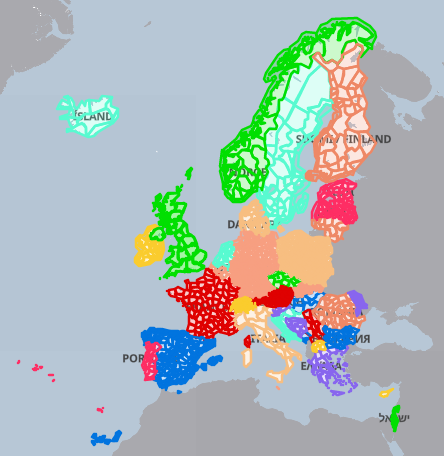

Weather Warnings from www.meteoalarm.org (EUMETNET member countries)
====================================================================

This script reads and caches weather awareness warnings from [**www.meteoalarm.org**](https://www.meteoalarm.org/) for one or more regions in countries that participate in [**EUMETNET**](https://www.eumetnet.eu.org/), and writes them out as ready-to-include HTML. The countries/areas in colour are available.



It is a Python port of `get-meteoalarm-warning-inc.php` (V3.16). **No PHP is needed**: a small Python 3 script (standard library only, Python 3.9+) runs on a schedule and writes static HTML files, and your pages show them with a server-side include or with the bundled `meteoalarm-embed.js`.

Warning text is shown in every language the national service publishes, one tab per language. Translations are provided by [**www.meteoalarm.org**](https://www.meteoalarm.org/); no additional translation is done.

Files
-----

| File | Purpose |
| --- | --- |
| `meteoalarm_warning.py` | fetches the feeds, caches them and writes the HTML |
| `meteoalarm-embed.js` | loads the HTML into any page in the browser and makes the language tabs work |
| `meteoalarm-geocode-aliases.json` | NUTS2/NUTS3/FIPS area codes mapped to EMMA_IDs |
| `meteoalarm-codenames.json` | EMMA_ID → area name, used in the "no current alerts" message |
| `ajax-images/meteoalarm_*.svg` | alert and info icons |

Keep `meteoalarm_warning.py` and the two JSON files in the same folder.

Finding your area
-----------------

Open [**https://saratoga-weather.org/meteoalarm-map/**](https://saratoga-weather.org/meteoalarm-map/), search for or zoom to your location, and hover over your area to see its EMMA\_ID. Repeat for any neighbouring areas you want.
**Caution:** each additional country means one more feed download from meteoalarm.org.

Running it
----------

```sh
python3 meteoalarm_warning.py --areas DK002,DK004,EE007 --cache-dir /var/www/html/ --tz Europe/Copenhagen
```

This writes three files to `--cache-dir`:

*   **meteoalarm-cache.json** – the matching warnings (refetched when older than `--cache-max-age`)
*   **meteoalarm-details.html** – full warning text, one tab per language, plus disclaimer
*   **meteoalarm-summary.html** – compact icons linking to the matching entry on the details page

Run it from cron so the files stay current, for example every 10 minutes:

```cron
*/10 * * * * cd /path/to/meteoalarm-warning && python3 meteoalarm_warning.py --config meteoalarm.json
```

### Settings

All settings can be given as command-line flags or in a JSON file passed with `--config` (flags win). `METEOALARM_AREAS` in the environment is used when no areas are given otherwise.

| Flag / JSON key | Default | Meaning |
| --- | --- | --- |
| `--areas` / `areas` | *(required)* | comma-separated EMMA\_IDs (a JSON list also works) |
| `--cache-dir` / `cache_dir` | `.` | where the cache and HTML files go |
| `--tz` / `tz` | `Europe/Brussels` | time zone for displayed times |
| `--date-format` / `date_format` | `%Y-%m-%d` | [strftime](https://docs.python.org/3/library/datetime.html#strftime-and-strptime-format-codes) date format |
| `--time-format` / `time_format` | `%H:%M %Z` | strftime time format |
| `--min-level` / `min_level` | `2` | lowest level shown: 1 green, 2 yellow, 3 orange, 4 red |
| `--cache-max-age` / `cache_max_age` | `300` | seconds before the feeds are fetched again |
| `--detail-page-url` / `detail_page_url` | `./wxadvisory.html` | page showing the details, used by the summary icon links |
| `--image-url` / `image_url` | `./ajax-images/meteoalarm_##.svg` | icon URL as seen by the browser; `##` is the icon number |
| `--image-dir` / `image_dir` | `ajax-images` next to the script | local icon folder, used to fall back to the generic icon |
| `--force` | off | ignore the cache and fetch now |
| `--test-file` | – | read a saved feed JSON instead of fetching (for testing) |

Example `meteoalarm.json`:

```json
{
  "areas": "DK002,DK004,EE007",
  "cache_dir": "/var/www/html/",
  "tz": "Europe/Copenhagen",
  "min_level": 2,
  "detail_page_url": "/wxadvisory.html"
}
```

Showing the warnings on your pages
----------------------------------

**In the browser (works on any static host):** put the generated files and `meteoalarm-embed.js` where your site serves them, then:

```html
<!-- summary, e.g. on your home page -->
<div data-meteoalarm-src="./meteoalarm-summary.html"></div>

<!-- details, on the page named in detail_page_url -->
<div data-meteoalarm-src="./meteoalarm-details.html"></div>

<script src="./meteoalarm-embed.js" defer></script>
```

**With a server-side include** (Apache SSI, nginx `ssi on`, or your static-site generator), include the file directly; the details file carries its own tab script:

```html
<!--#include virtual="/meteoalarm-details.html" -->
```

The output is UTF-8 only (as is the meteoalarm.org data), so pages must be served as UTF-8.

Changes from the PHP version
----------------------------

*   Runs as a scheduled Python script instead of on each page view; the page visitor never waits for meteoalarm.org.
*   Cache is JSON (`meteoalarm-cache.json`) instead of a PHP serialized array; the alias table is JSON instead of PHP.
*   Text from the feed is HTML-escaped before output.
*   An alert covering several of your areas is listed under each of them in the summary (the PHP version used only the last one).
*   Default time format is 24-hour, since the old `h:i` default had no AM/PM.
*   Settings come from flags or a JSON file rather than Saratoga template `Settings.php`.

Credits
-------

Original PHP script by Ken True, [saratoga-weather.org](https://saratoga-weather.org/), adapted with permission from wrnWarningEU-CAP.php by Wim van der Kuil, [pwsdashboard.com](https://pwsdashboard.com/). Warning data © EUMETNET-METEOalarm and the respective National Meteorological Services, used per the [meteoalarm.org Terms & Conditions](https://meteoalarm.org/page/terms-and-conditions).
